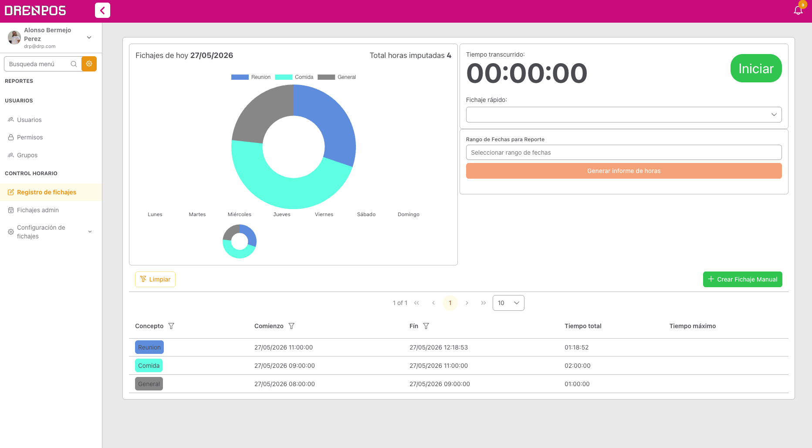
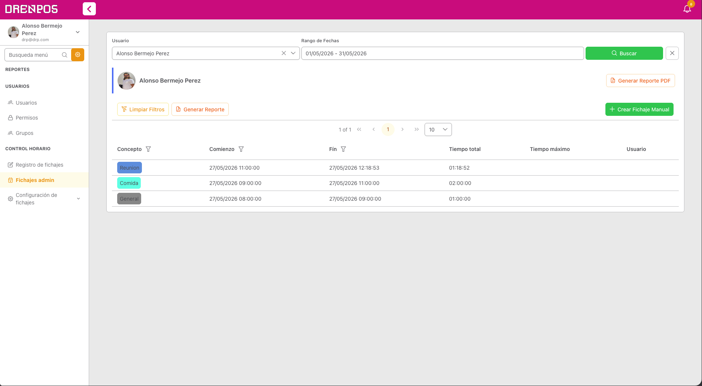
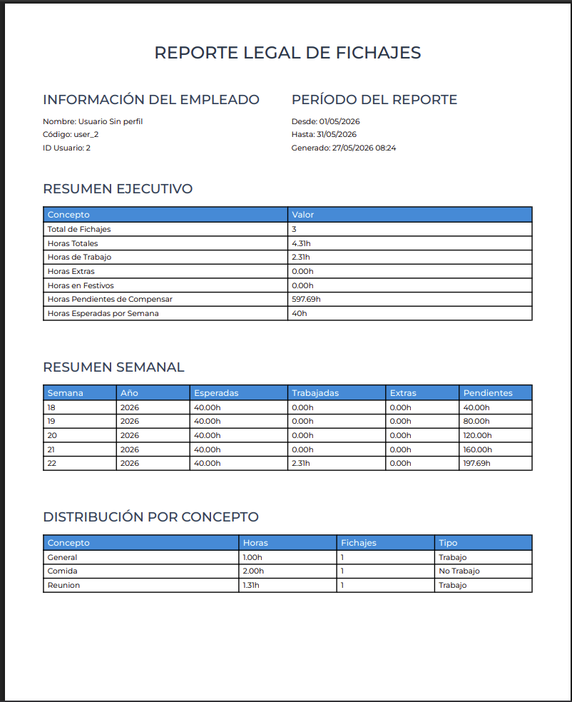
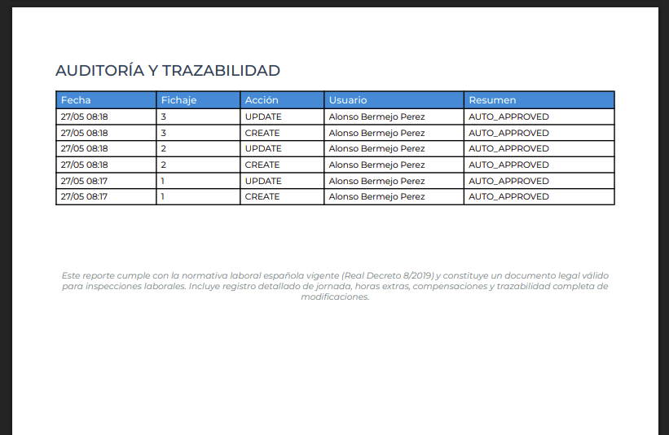
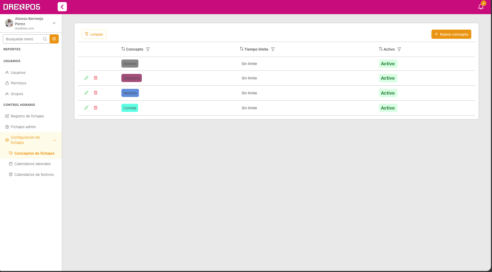
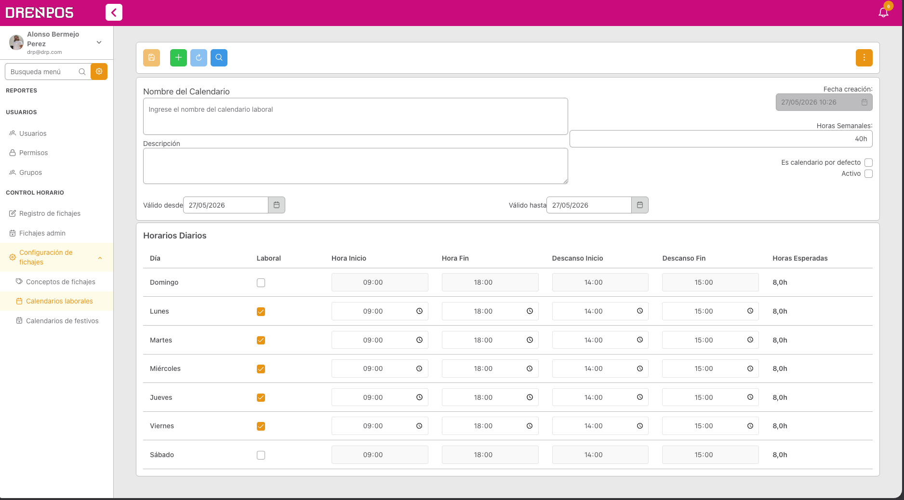
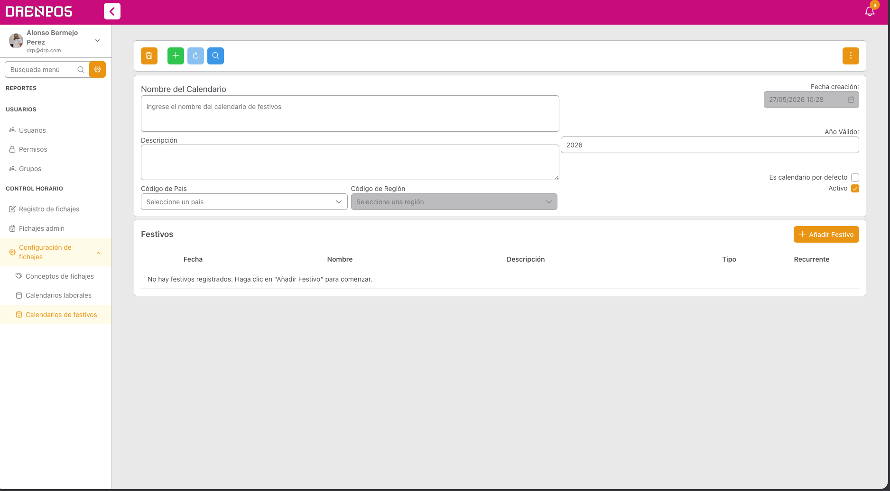
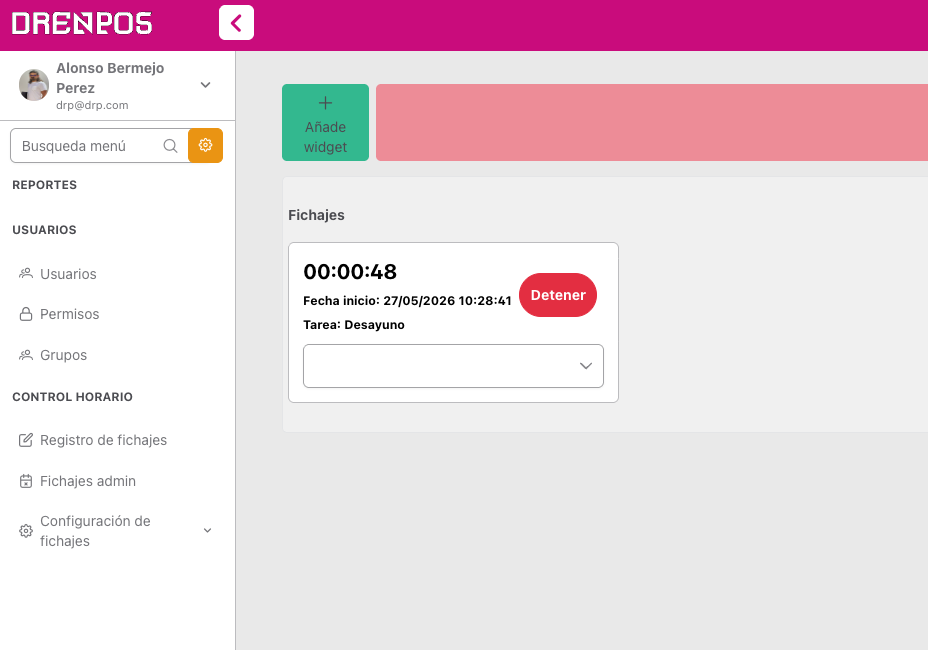

# Control horario drenpos

- Funcaionalidades

Gestion persinal de fichajes donde se puede ver los fichaes personales un grafico con las dedicadiones, poder fichar y desfichar, exportar reporte de fichajes propio en un rango de tiempo, etc.

Gestion de fichajes para managers donde se pueden ver los fichajes de su equipo, poder exportar reportes modificar/crear fichajes y exportar reportes de fichajes en un rango de tiempo

Reporte de fichaje customizado este es pordefecto donde podemos ver las horas dedicadas , horas pendientes a dedicar, horas extras , horas dedicadas a que cosas y la tabla de trazabilidad donde se ve todo lo que oducrre quien lo hace, cuando y por que

Conceptos de fichajes, sistema para poder crear conceptos de fichajes para luego poder asignar a los fichajes y asi poder tener un control mas detallado de a que se dedica el tiempo, pudiendo defirnir que un tipo imputa en tiempo laboralr o no e icnluso poner tiempos limites a cada concepto lo que nos dá mas funcioanlidades en reportes

Creacion de calendarios laborarles los cuales podemos confiurar los horarios laborales, festivos, etc, los cuales despues se pueden asignar a cada empleado y así los reportes y horas dedicadas se calculan e imputan segun su calendario

Widget de fichajes rapido lo añades a a la pantalla inicial y fichas rapido sin tener que entrar a la pantalla de fichajes, ideal para fichar y desfichar rapido

Control de fichajes por llavero rfid o qr del empleado, el sistema pone a disposicion un dispositivo que se puede tnere fisico donde con un llavero customizado, con rfid o con el qr de fichajes que puedes sacar de cada empleado se inicia el fichaje o se detiene.(de este no tenemos imagenes debes de sacar algunas de la web)
